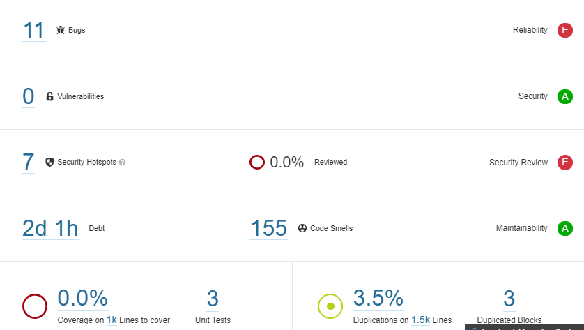

 # Diagrama de clases

 # Diagramas de Secuencia

 ## Diagrma Delete
 

 ## Diagrama Update
 

 ## Diagrama Report
 

 ## Diagram Insert
 

 ## Diagrama Import
 

 ## Diagrama Export
 

 # SonarQube

 
